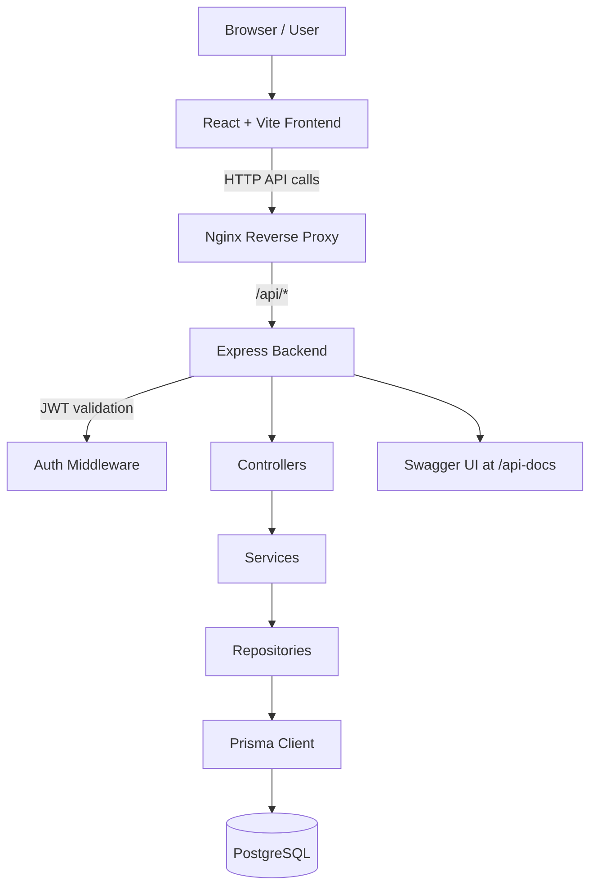

# System Architecture Overview

This project is a full-stack internal task management dashboard with a decoupled frontend, a secured Express API, and a PostgreSQL database managed via Prisma.

---

## 1. High-Level Architecture



### Runtime composition
- Frontend: React SPA served by Vite in development and by Nginx in Docker
- Backend: Express API on port 5000
- Database: PostgreSQL on port 5432
- Reverse proxy: Nginx handles frontend static delivery and proxies API traffic

---

## 2. Directory Structure

```text
TaskDashboradProject/
├── backend/
│   ├── prisma/
│   │   ├── schema.prisma
│   │   ├── seed.js
│   │   └── migrations/
│   ├── src/
│   │   ├── app.js
│   │   ├── server.js
│   │   ├── config/
│   │   │   ├── db.js
│   │   │   ├── env.js
│   │   │   ├── prisma.js
│   │   │   └── swagger.js
│   │   ├── controllers/
│   │   │   ├── auth.controller.js
│   │   │   ├── comments.controller.js
│   │   │   ├── dashboard.controller.js
│   │   │   ├── external.controller.js
│   │   │   ├── notifications.controller.js
│   │   │   ├── tasks.controller.js
│   │   │   └── users.controller.js
│   │   ├── middleware/
│   │   │   ├── auth.middleware.js
│   │   │   ├── error.middleware.js
│   │   │   ├── notFound.middleware.js
│   │   │   ├── requestLogger.middleware.js
│   │   │   └── role.middleware.js
│   │   ├── repositories/
│   │   ├── routes/
│   │   │   ├── auth.routes.js
│   │   │   ├── comments.routes.js
│   │   │   ├── dashboard.routes.js
│   │   │   ├── external.routes.js
│   │   │   ├── health.routes.js
│   │   │   ├── index.js
│   │   │   ├── notifications.routes.js
│   │   │   ├── tasks.routes.js
│   │   │   └── users.routes.js
│   │   ├── schemas/
│   │   ├── services/
│   │   ├── utils/
│   │   └── validators/
│   ├── Dockerfile
│   ├── package.json
│   └── scripts/
│
├── frontend/
│   ├── src/
│   │   ├── App.jsx
│   │   ├── main.jsx
│   │   ├── components/
│   │   ├── context/
│   │   ├── hooks/
│   │   ├── pages/
│   │   ├── routes/
│   │   ├── services/
│   │   ├── store/
│   │   └── styles/
│   ├── public/
│   ├── index.html
│   ├── package.json
│   ├── vite.config.js
│   └── Dockerfile
│
├── nginx/
│   └── default.conf
├── docs/
│   ├── API.md
│   ├── ARCHITECTURE.md
│   └── DATABASE.md
├── docker-compose.yml
├── README.md
└── .gitignore
```

---

## 3. API Layer Structure

The backend is organized in a layered pattern:

1. `routes/`
   - HTTP endpoints for `/health`, `/auth`, `/dashboard`, `/tasks`, `/users`, `/notifications`, and `/external`
2. `controllers/`
   - Validate input and map HTTP requests to service calls
3. `services/`
   - Hold business logic, notifications, dashboard aggregation, and workflow rules
4. `repositories/`
   - Encapsulate Prisma queries and DB access patterns
5. `utils/`
   - Shared validation, pagination, errors, and response formatting helpers

The express app boots in `backend/src/app.js` and starts listening in `backend/src/server.js`.

---

## 4. Request Flow

### Authentication flow
1. User logs in through the frontend at `/login`.
2. Frontend sends credentials to `/api/auth/login`.
3. Backend validates payload and issues a JWT.
4. JWT is stored on the client and sent in the `Authorization: Bearer ...` header.
5. `authMiddleware` verifies the token for protected endpoints.

### Task flow
1. User navigates to the task list or task detail view.
2. The frontend calls `/api/tasks` or `/api/tasks/:id`.
3. Controller validates query parameters or body payload.
4. Service performs permission checks, repository calls, and activity notifications.
5. Prisma updates the `tasks` table and related records.
6. Updates are reflected in the UI with React Query invalidation and refreshes.

### External API flow
1. The app reads external source settings from the `settings` table.
2. The service checks an in-memory cache before making a request.
3. It fetches external data via Axios and normalizes the result.
4. It stores the transformed data in cache and returns it to the UI.

---

## 5. Frontend Route Model

The SPA route structure is defined in `frontend/src/routes/AppRoutes.jsx`.

Public route:
- `/login`

Protected routes:
- `/` → dashboard
- `/tasks` → task list
- `/tasks/:id` → task details
- `/users` → user management, restricted to `ADMIN` and `MANAGER`
- `/external-users` → external integration screen, restricted to `ADMIN` and `MANAGER`

A `ProtectedRoute` wrapper gates access based on auth state and role membership.

---

## 6. Security and Observability

The backend includes the following protections:
- Helmet for HTTP headers
- CORS configuration
- Compression
- Request rate-limiting
- JWT authentication middleware
- Role-based middleware for `ADMIN`, `MANAGER`, and `MEMBER`
- Structured error handler and not-found middleware
- Request logger middleware for request tracking

The Swagger UI is exposed at `/api-docs`, which reflects the API contract for the current app.

---

## 7. Deployment Model

The project uses Docker Compose for the local runtime stack:
- `postgres` service for PostgreSQL
- `backend` service for the Express API
- `frontend` service for the static app served by Nginx

This matches the actual deployment layout defined in `docker-compose.yml`.
